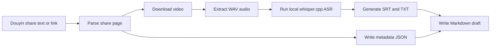

# 抖音视频一键整理智能体技能

还在为冗长的抖音视频浪费时间？还在到处找无水印下载工具？这个智能体技能就是为这件事准备的。

你只需要粘贴一条抖音链接，系统就会自动完成一整套流程：

- 解析抖音分享链接
- 下载无水印高清视频
- 提取音频并生成字幕文本
- 输出视频元数据
- 生成一份可继续深加工的 Markdown 文档草稿

它不是简单的“下载器”，而是一套面向信息处理的自动化工作流。你不需要再反复拖动进度条、逐段听内容、手动记笔记，而是可以更快拿到一条视频的核心信息、字幕原文和后续可复用素材。

适合这些场景：

- 学习长视频内容，不想从头看到尾
- 批量整理抖音里的知识型、资讯型、技术型内容
- 把抖音视频转成研究资料、学习笔记、选题素材
- 下载纯净视频素材，用于二次整理或创作流程

全面支持接入主流智能体工作流，例如：

- Codex
- Claude Code
- OpenClaw

真正做到：贴一个链接，自动把视频变成“可读、可存、可复用”的内容资产。

## 它能做什么

输入支持两种形式：

- 一条抖音分享链接
- 一整段从抖音复制出来的分享文案

输出文件包括：

- `VIDEO_ID.mp4`
- `VIDEO_ID.wav`
- `VIDEO_ID.<model>.srt`
- `VIDEO_ID.<model>.txt`
- `VIDEO_ID.metadata.json`
- `YYYY-MM-DD-douyin-<slug>-<video_id>.draft.md`

## 工作流程



## 安装为 Skill

如果你的环境支持 `skills` 安装器，可以直接执行：

```bash
npx skills add <owner>/<repo> --global
```

也可以手动安装：把仓库内容放进你自己的全局 skills 目录。

以 Windows 上的 Codex 为例，全局 skill 目录通常类似这样：

```text
C:\Users\<you>\.codex\skills\
```

## 本地运行要求

- Windows with PowerShell
- Python 3.10+
- `ffmpeg` available on `PATH`
- internet access for downloading Douyin pages and whisper.cpp model files

脚本会使用 `ffmpeg` 内置的 `whisper` 滤镜，并从 `hf-mirror.com` 下载本地 `ggml` 模型文件。

## 配置说明

默认输出目录：

```text
%USERPROFILE%\douyin-video-docs
```

你也可以通过环境变量覆盖：

```powershell
$env:DOUYIN_VIDEO_TO_DOC_OUTPUT_DIR = "D:\dolan_env\temp\project\personal\douyin-video-docs"
```

也可以在单次运行时直接指定输出目录：

```powershell
python .\scripts\douyin_video_to_doc.py --input "这里填写抖音分享链接或完整分享文案" --output-dir "D:\custom\path"
```

## 使用方式

在仓库根目录下运行：

```powershell
python .\scripts\douyin_video_to_doc.py --input "这里填写抖音分享链接"
```

如果你拿到的是一整段抖音分享文案，也可以直接这样传入：

```powershell
python .\scripts\douyin_video_to_doc.py --input "这里填写从抖音复制出来的完整分享文案"
```

如果你想显式指定转写模型：

```powershell
python .\scripts\douyin_video_to_doc.py --input "这里填写抖音分享链接" --model small
```

当前可选模型：

- `base`
- `small`

如果你更看重转写质量而不是速度，优先使用 `small`。

## 如何把草稿整理成最终文档

脚本会先生成一份 Markdown 草稿，其中包含：

- 视频基础信息
- 处理说明
- 字幕原文
- 详细解读的占位结构

推荐的后续整理步骤：

1. 先通读字幕文本。
2. 根据上下文修正明显的 ASR 识别错误。
3. 再把草稿扩展成完整整理稿，至少补齐：
   - 核心观点
   - 详细机制
   - 举例说明
   - 局限与注意点
   - 可复用结论

## 注意事项与限制

- 抖音页面通常不会直接暴露可复用的官方字幕。
- 在这种情况下，字幕文本来自本地 ASR 转写，并不是平台官方字幕。
- 专有名词、人名、产品名有时需要结合上下文人工修正。
- 部分抖音链接可能会因为地区、时间或平台策略变化而失效或重定向异常。
